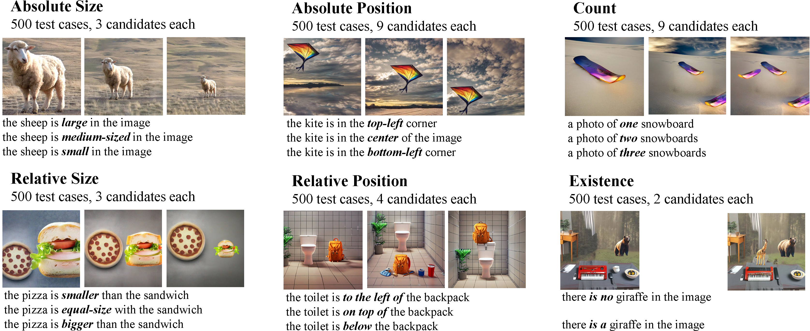

# Synthesize, Diagnose, and Optimize: Towards Fine-Grained Vision-Language Understanding
[](https://arxiv.org/abs/2312.00081)


**Authors**: Wujian Peng , Sicheng Xie, Zuyao You, [Shiyi Lan](https://voidrank.github.io/), [Zuxuan Wu](https://zxwu.azurewebsites.net/)

## :fire: Updates
* `Feb 28, 2024` Our work has been accepted by [CVPR 2024](https://cvpr.thecvf.com/) 🎉🎉🎉, the code and data will be coming soon.

## :mag: Overview
> To evaluate the understanding capability of visual-language models on fine-grained concepts, we propose a new benchmark, SPEC, 
> which consists of six distinct subsets, distributed across the dimensions of Size, Position, Existence and Count.
> Each test case consists of an image candidate set, which differs only in certain visual concept, and a text candidate set, 
> which differs only in corresponding language concept.
<p align="center">
  
<br>
</p>

## :memo: TODO
- [ ] Release the demo of our data synthesize pipeline
- [ ] Release the data of SPEC benchmark
- [ ] Release the evaluation code of SPEC


## :black_nib: Citation
If you use our code or data in this repo, or find our work helpful, please consider giving a citation:

```
@inproceedings{peng2024spec,
  title={Synthesize, Diagnose, and Optimize: Towards Fine-Grained Vision-Language Understanding},
  author={Wujian Peng, Sicheng Xie, Zuyao You, Shiyi Lan, Zuxuan Wu}, 
  booktitle={CVPR},
  year={2024}
}
```
