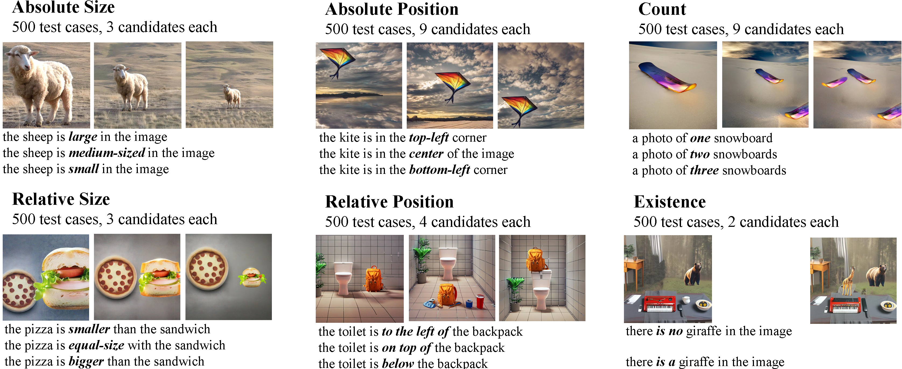

<div align="center" style="font-family: charter;">
<h1><i>SPEC</i>: Synthesize, Diagnose, and Optimize: Towards Fine-Grained Vision-Language Understanding</h1>
<a href="https://arxiv.org/abs/2312.00081" target="_blank">
    
</a>
<a href="https://huggingface.co/datasets/wjpoom/SPEC" target="_blank">
    
</a>
<a href="https://github.com/wjpoom/SPEC/tree/main/notebooks" target="_blank">
    
</a>
<a href="https://github.com/wjpoom/SPEC/blob/main/assets/poster-v2.pdf" target="_blank">
    
</a>

<div>
    <a href="https://scholar.google.com/citations?user=GTuWk9YAAAAJ&hl=zh-CN" target="_blank">Wujian Peng</a><sup></sup>,</span>
    Sicheng Xie<sup></sup>,</span>
    Zuyao You<sup></sup>,</span>
    <a href="https://voidrank.github.io/" target="_blank">Shiyi Lan</a><sup></sup>,</span>
    <a href="https://zxwu.azurewebsites.net/" target="_blank">Zuxuan Wu</a><sup>&dagger;</sup>,</span>
</div>

<div>
    <sup>&dagger;</sup> Corresponding author&emsp;
</div>

</div>

## :fire: News
* `Apr. 14, 2024` We have released a [preview](https://wjpoom.github.io/preview/) of a more advanced dataset version, the full version will come soon.
* `Apr. 13, 2024` We released the SPEC dataset and the code for evaluation, sorry for the delay :relaxed:.
* `Feb. 28, 2024` Our work has been accepted by [CVPR 2024](https://cvpr.thecvf.com/) :tada:.

## :rocket: A more advanced version is coming!
We are building a new version with a larger data scale, more object categories, and higher-quality images and text, and more. 
You can preview it at [this website](https://wjpoom.github.io/preview/), and the full version will come soon.

## :mag: SPEC Benchmark
To evaluate the understanding capability of visual-language models on fine-grained concepts, we propose a new benchmark, SPEC, 
which consists of six distinct subsets, distributed across the dimensions of **S**ize, **P**osition, **E**xistence, and **C**ount.
Each test case consists of an image candidate set, which differs only in certain visual concepts, and a text candidate set, 
which differs only in the corresponding language concept.
<p align="center">
  
<be>
</p>

## :wrench: Usage
### install
``` shell
git clone https://github.com/wjpoom/SPEC.git
cd SPEC/
pip install -e .
```
### prepare data
* run the following code in Python shell, replace `/path/to/save/data` with a specified dir to store the data.
```python
import zipfile
import os
from huggingface_hub import hf_hub_download

data_root = '/path/to/save/data'
hf_hub_download(repo_id='wjpoom/SPEC', repo_type='dataset', filename='data.zip', local_dir=data_root)

with zipfile.ZipFile(os.path.join(data_root, 'data.zip'), 'r') as zip_ref:
    zip_ref.extractall(os.path.join(data_root))
    
os.remove(os.path.join(data_root, 'data.zip'))
```
### explore the dataset
* We provide a 📓notebook that enables you to visually explore the test samples in the SPEC dataset.
* Run this notebook either [locally](https://github.com/wjpoom/SPEC/blob/main/notebooks/explore_spec_local.ipynb) or online using [Colab](https://colab.research.google.com/github/wjpoom/SPEC/blob/main/notebooks/explore_spec_colab.ipynb).

### reproduce the results
* In our paper, we evaluated four popular VLMs using our SPEC dataset, namely: CLIP, BLIP, FLAVA and CoCa.
* To reproduce the results with these VLMs, you can run [this script](https://github.com/wjpoom/SPEC/blob/main/spec/run_eval.sh).
* You can also reproduce with this [local notebook](https://github.com/wjpoom/SPEC/blob/main/notebooks/evaluate_example_local.ipynb) or the online [Colab notebook](https://colab.research.google.com/github/wjpoom/SPEC/blob/main/notebooks/evaluate_example_colab.ipynb).

### evaluate custom VLMs
* If you want to evaluate your custom model on SPEC, you can follow the instructions in [this document](https://github.com/wjpoom/SPEC/blob/main/docs/evaluate_custom_model.md).

## :memo: TODO
- [ ] Release the newly built version of the dataset
- [ ] Release the code of our data synthesize pipeline
- [x] Release the testing set of SPEC benchmark
- [x] Release the evaluation code of SPEC

## :clap: Acknowledgement
Part of this repository is built upon [ARO](https://github.com/mertyg/vision-language-models-are-bows), thanks for the well-organized codebase.

## Contact Us
Feel free to contact us if you have any questions or suggestions 

Email (Wujian Peng): wjpeng24@m.fudan.edu.cn

## :black_nib: Citation
If you use our code or data in this repo or find our work helpful, please consider giving a citation:

``` bibtex
@inproceedings{peng2024synthesize,
  title={Synthesize diagnose and optimize: Towards fine-grained vision-language understanding},
  author={Peng, Wujian and Xie, Sicheng and You, Zuyao and Lan, Shiyi and Wu, Zuxuan},
  booktitle={Proceedings of the IEEE/CVF Conference on Computer Vision and Pattern Recognition},
  pages={13279--13288},
  year={2024}
}
```
